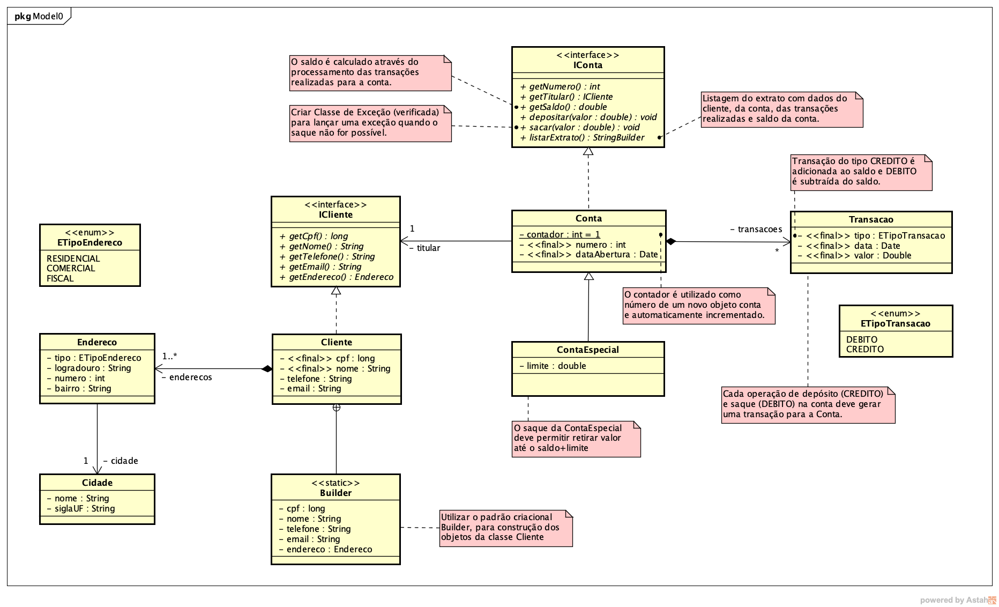

# Sistema para gerenciar contas bancárias

 Consiste num sistema onde é possível gerenciar contas bancárias. Permite o cadastro de clientes e contas (além de armazenar o seu histórico de operações). 

## Funcionalidades:

- [x] Cadastro de cliente
- [x] Cadastro de conta (normal/especial)
- [x] Cadastro de operações (crédito/débito)

## Sobre:

 Esse sistema foi desenvolvido para a disciplina Programação Orientada a Objetos, seguindo os requisitos do diagrama abaixo. 

## Modo de uso:

1. Instalar o Java 8
2. Compilar os códigos .java