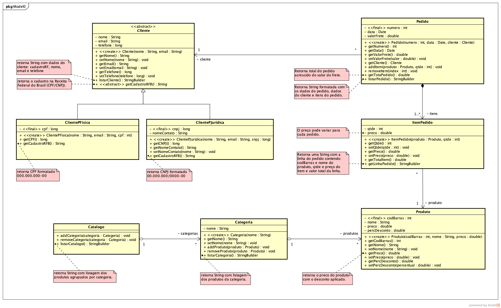

# Sistema para gerenciamento de pedidos

 Consiste num sistema onde é possível gerenciar pedidos. Permite o cadastro de clientes e pedidos, além de armazenar o catálogo de serviços oferecidos. 

## Funcionalidades:

- [x] Cadastro de cliente
- [x] Cadastro de pedido
- [x] Cadastro de catálogo

## Sobre:

 Esse sistema foi desenvolvido para a disciplina Programação Orientada a Objetos, seguindo os requisitos do diagrama abaixo. 

## Modo de uso:

1. Instalar o Java 8
2. Compilar os códigos .java