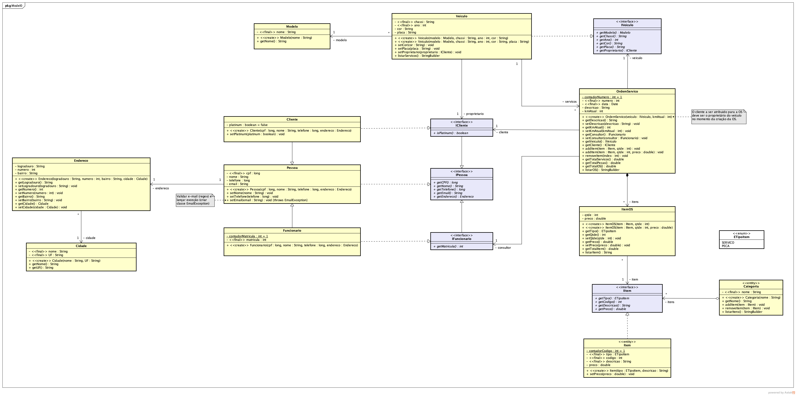

# Sistema para gerenciamento de ordens de serviço de uma oficina

 Consiste num sistema onde é possível gerenciar os serviços de uma oficina. Permite o cadastro de clientes, funcionários, ordens de serviço, além de armazenar o catálogo de serviços oferecidos. 

## Funcionalidades:

- [x] Cadastro de usuário
- [x] Cadastro de cliente
- [x] Cadastro de funcionário
- [x] Cadastro de ordem de serviço
- [x] Cadastro de veículo
- [x] Cadastro de catálogo
- [ ] Persistência dos dados

## Sobre:

 Esse sistema foi desenvolvido para a disciplina Programação Orientada a Objetos, seguindo os requisitos do diagrama abaixo. 

## Modo de uso:

1. Instalar o Java 8
2. Compilar os códigos .java